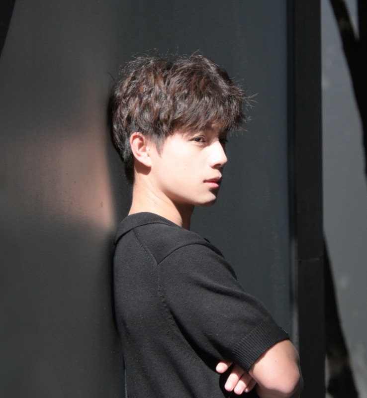
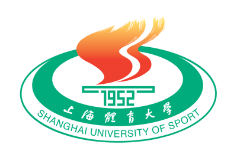

::: {.profile-layout}
::: {.profile-sidebar}
::: {.profile-card}

# Weijie Zhou

Undergraduate Student in Kinesiology

::: {.profile-location}
Shanghai University of Sport
:::

::: {.profile-links}
<a class="profile-link" href="mailto:24630315@sus.edu.cn">Email</a>
<a class="profile-link" href="https://github.com/Scarf-0">GitHub</a>
<a class="profile-link" href="https://scholar.google.com/citations?user=gH0O28cAAAAJ&hl=en">Google Scholar</a>
:::
:::
:::

::: {.profile-content}
## About

I am an undergraduate student majoring in Kinesiology at the School of Exercise and Health, Shanghai University of Sport. My research interests center on sports biomechanics, with a particular interest in musculoskeletal simulation, running biomechanics, and optimal control.

## Education

::: {.entry}

::: {.entry-body}
### Shanghai University of Sport

**BSc Student in Kinesiology**  
School of Exercise and Health

::: {.entry-date}
September 2024 – Present
:::
:::
:::

## Research Interests

::: {.interest-list}
::: {.interest-row}
**Musculoskeletal Simulation**

Computational approaches to muscle function, joint loading, and human movement.
:::

::: {.interest-row}
**Running Biomechanics**

The mechanics of running and their relationship with movement strategies and performance.
:::

::: {.interest-row}
**Optimal Control**

Optimization-based methods for understanding and predicting movement.
:::
:::

## Published Papers

::: {.publication-entry}
::: {.publication-year}
2026
:::

::: {.publication-body}
### [Effects of different post-activation potentiation strategies on forehand stroke performance in elite squash players: a muscle synergy and time-frequency coherence analysis](https://doi.org/10.1186/s13102-025-01487-7)

**Weijie Zhou**, Xinyu Lin, Haojie Li, Xie Wu, and Jian Jiang  
*BMC Sports Science, Medicine and Rehabilitation*, **18**, 87 (2026).  
Co-first author

[DOI](https://doi.org/10.1186/s13102-025-01487-7){.paper-link}
[Google Scholar](https://scholar.google.com/citations?view_op=view_citation&hl=en&user=gH0O28cAAAAJ&citation_for_view=gH0O28cAAAAJ:u5HHmVD_uO8C){.paper-link}
[Full text](https://link.springer.com/article/10.1186/s13102-025-01487-7){.paper-link}
:::
:::

## Projects

::: {.quiet-note}
Projects will be added as they become available. Code and learning notes can be found on [GitHub](https://github.com/Scarf-0).
:::
:::
:::
